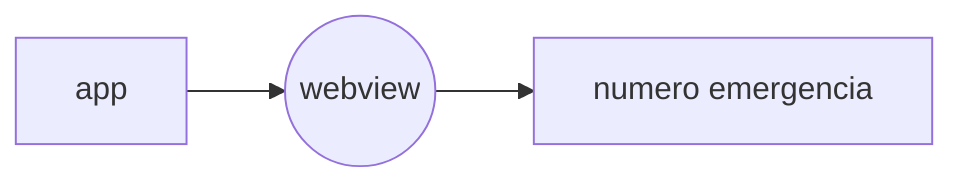

# Ligação de Emergencia
Para aqueles que desejam disponibilizar uma funcionalidade que ao ser clicada realize uma ligação para um número de emergencia, basta disponibilzar uma página com este código apenas alterando o valor do telefone para que realize a ligação.

> É possível que ao clicar na funcionalidade a mesma já realize a ligação evitando um novo clique em um botão, neste caso basta remover a linha comentada no index.html

> **Obs**: Trata-se de um código simples que pode ser estilizado conforme necessidade da Operadora

## Test

> https://rannyzyzz.github.io/sample-emergency-call/

